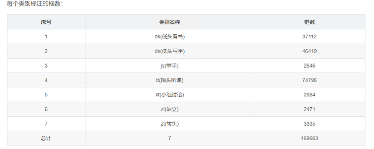
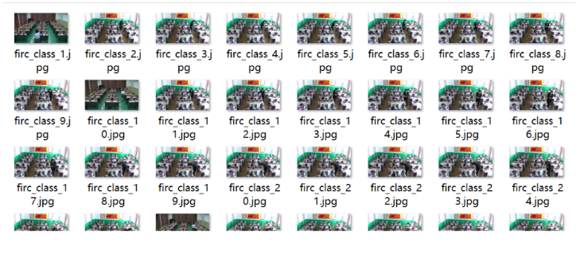
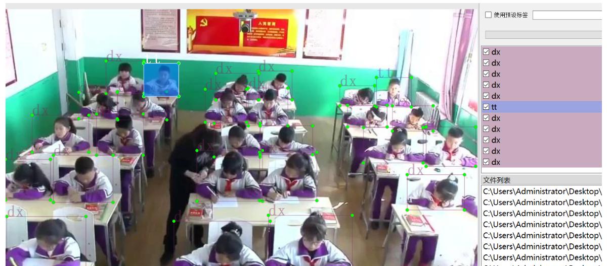

# Student Classroom Behavior Detection Dataset VOC+YOLO Format: 5622 Images in 7 Categories. 7Z

Size: 268.46MB in 7Z format

The dataset is in Pascal VOC format + YOLO format (excluding the split path's txt file, only including jpeg images and corresponding VOC format xml files and yolo format txt files).

Number of images (jpg file count): 5622

Number of annotations (xml file count): 5622

Number of annotations (txt file count): 5622

Number of annotation categories: 7

Annotation category names: [“dk”,“dx”,“js”,“tt”,“xt”,“zl”,“zt”]

Annotation tool: labelImg

Annotation rules: draw bounding boxes for each category

Important note: There is no specific statement about the accuracy or precision guarantee of the trained model or weight files; this dataset only provides accurate and reasonable annotations.

Image preview:

## Images

Here is a pay link on Stripe ( https://buy.stripe.com/3cs8yP7sY87d0vu9AB ). Please contact me lonlonago@foxmail.com after funding $89, and I will send you a complete data files , thank you!

